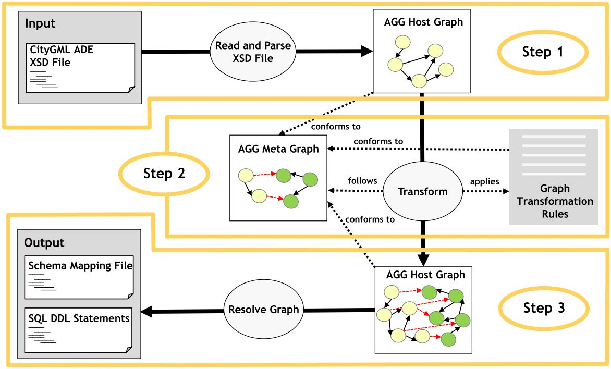

ADE Manager Plugin
======================================

The ADE Manager is a plugin for the [3D City Database Importer/Exporter](https://github.com/3dcitydb/importer-exporter) and allows to dynamically extend a 3D City Database (3DCityDB) instance for high-performance storage and management of CityGML Application Domain Extensions (ADE). It is implemented based on the open-source [graph transformation engine (AGG)](http://www.user.tu-berlin.de/o.runge/agg/) for realizing the automatic transformation of the object-oriented data model from a given ADE's application schema (XSD) to a compact relational database schema (including tables, indexes, and constrains etc.). In addition, an XML-based schema-mapping file can also be automatically generated which contains the relevant meta-information about the derived database schema as well as the explicit mapping relationships between the two schemas and allows developers to implement applications for managing and processing the ADE data contents stored in a 3DCityDB instance. 

Transformation Workflow
-------

License
-------
The ADE Manager Plugin is licensed under the [Apache License, Version 2.0](http://www.apache.org/licenses/LICENSE-2.0). See the `LICENSE` file for more details.

Latest release
--------------
The latest stable release of the ADE Manager Plugin is 4.0.0.

Download the software [here](https://github.com/3dcitydb/plugin-ade-manager/releases). Previous releases are available from the [releases section](https://github.com/3dcitydb/plugin-ade-manager/releases).

Installation
------------
The ADE Manager Plugin is shipped with the universal installer of the Importer/Exporter tool. When running the setup wizard, you can choose to install the plugin. This is the recommended and easiest way to install the plugin.

Alternatively, you may download the software from the [releases section](https://github.com/3dcitydb/plugin-ade-manager/releases) and unzip it into the `plugins` folder within the installation folder of the Importer/Exporter. After a restart of the Importer/Exporter, the ADE Manager will be ready to be used.

System requirements
-------------------
Each version of the ADE Manager plugin is built against a specific version of the Importer/Exporter. Please check the release notes of the version you want to use for more information. 

Documentation
-------------
A complete and comprehensive documentation on the ADE Manager Plugin is installed with the [3D City Database Importer/Exporter](https://github.com/3dcitydb/importer-exporter) and is available [online](https://www.3dcitydb.org/3dcitydb/documentation/).

Contributing
------------
* To file bugs found in the software create a GitHub issue.
* To contribute code for fixing filed issues create a pull request with the issue id.
* To propose a new feature create a GitHub issue and open a discussion.

Developers
----------
The ADE Manager plugin has been developed by and with the support from the following cooperation partners:

* [Chair of Geoinformatics, Technical University of Munich](https://www.gis.bgu.tum.de/)
* [virtualcitySYSTEMS GmbH, Berlin](http://www.virtualcitysystems.de/)
* [M.O.S.S. Computer Grafik Systeme GmbH, Taufkirchen](http://www.moss.de/)

More information
----------------
[OGC CityGML](http://www.opengeospatial.org/standards/citygml) is an open data model and XML-based format for the storage and exchange of semantic 3D city models. It is an application schema for the [Geography Markup Language version 3.1.1 (GML3)](http://www.opengeospatial.org/standards/gml), the extendible international standard for spatial data exchange issued by the Open Geospatial Consortium (OGC) and the ISO TC211. The aim of the development of CityGML is to reach a common definition of the basic entities, attributes, and relations of a 3D city model. Particularly, CityGML provides an extension mechanism called “Application 
Domain Extension (ADE)” which allows third parties to dynamically extend the existing CityGML data models with application specific extensions for facilitating the application fields e.g. energy demand calculations, utility network analysis, facility management, noise propagation simulations etc. 

CityGML is an international OGC standard and can be used free of charge.
